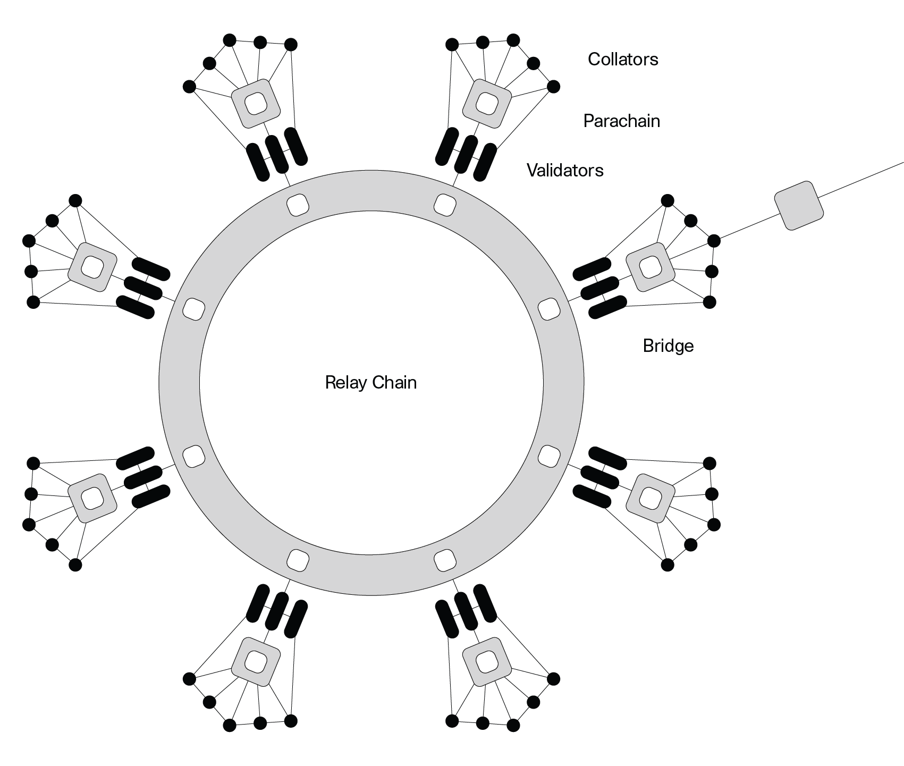

:::info Welcome to the Selendra Wiki

The Selendra Wiki serves as the source of truth for Selendra. It is a community-focused
initiative led by Selendra Foundation to keep an up-to-date resource on the best information for
learning, building, and maintaining on Selendra.

The Wiki has three main sections: Learn (for learners), Build (for people that want to build on
Selendra), and Maintain (for people that want to maintain the network).

:::

## What is Selendra?

Selendra is a fully-sharded blockchain.

Selendra is a Relaychain that enables scalability by allowing specialized blockchains to communicate with each other in a secure, trust-free environment.

Selendra is built to connect and secure unique blockchains, whether they be public, permissionless
networks, private consortium chains, or other Web3 technologies. It enables an internet where
independent blockchains can exchange information under common security guarantees.

Selendra is the core pillars of governance and upgradability. The network has
an advanced suite of governance tools and, using the [WebAssembly](https://webassembly.org/)
standard as a "meta-protocol", can autonomously deploy network upgrades. Selendra adapts to your
growing needs without the risks of network forks.

:::note Learn more about Governance

If you haven't heard of Governance before, a great place to start is the
[Governance page](../learn/learn-governance.md)

:::

### Interact with Selendra

<tr class="cards-container">
  <td>
    <a class="guide-link" href="../docs/learn-account-generation">
      
        

            <h5 class="cards-title">Creating an Account</h5>
        

    </a>
  </td>
  <td>
    <a class="guide-link" href="../docs/learn-balance-transfers">
      
        

            <h5 class="cards-title">Balance Transfers</h5>
        

    </a>
  </td>
  <td>
    <a class="guide-link" href="../docs/learn-staking">
      
              

                  <h5 class="cards-title">Staking</h5>
              

    </a>
  </td>
</tr>

 

<tr class="cards-container">
  <td>
    <a class="guide-link" href="../docs/learn-parachains">  
      
              

                  <h5 class="cards-title">Parachains</h5>
              

    </a>
  </td>
  <td>
    <a class="guide-link" href="../docs/learn-bridges">  
      
              

                  <h5 class="cards-title">Bridges</h5>
              

    </a>
  </td>
  <td>
    <a class="guide-link" href="../docs/maintain-guides-how-to-vote-councillor">
      
              

                  <h5 class="cards-title">Vote for Councilors</h5>
              

    </a>
  </td>
</tr>

 

<tr class="cards-container">
  <td>
  <a class="guide-link" href="../docs/learn-treasury#creating-the-proposal">
    
            

                <h5 class="cards-title">Make Proposals</h5>
            

  </a>
  </td>
  <td>
    <a class="guide-link" href="../docs/maintain-guides-how-to-join-council#submit-candidacy">  
      
              

                  <h5 class="cards-title">Council Candidacy</h5>
              

    </a>
  </td>
  <td>
    <a class="guide-link" href="../docs/learn-treasury">  
      
              

                  <h5 class="cards-title">Treasury</h5>
              

    </a>
  </td>
</tr>

 

<tr class="cards-container">
  <td>
    <a class="guide-link" href="../docs/learn-identity">
      
              

                 <h5 class="cards-title">Set an Identity</h5>
              

    </a>
  </td>
  <td>
    <a class="guide-link" href="../docs/learn-proxies">
      
              

                  <h5 class="cards-title">Proxy Accounts</h5>
              

    </a>
  </td>
</tr>

 

### What can I do with my SEL?

[SEL](../learn/learn-SEL.md) is the native token of the Selendra Network. SEL can be used for
transaction fees, staking, governance, acquisition of a parachain slot and for enabling several key
functionalities on Selendra.

- **1 SEL**: the minimum balance required to have an active account on Selendra Network. If your
  account balance drops below 1 SEL, your account will be reaped. Learn more about
  [Accounts](../learn/learn-accounts.md) and the
  [Existential Deposit](../build/build-protocol-info.md#existential-deposit) requirement.

- **5 SEL**: the minimum contribution required to participate in
  [crowdloans](../learn/learn-crowdloans.md) for
  [parachain slot auctions](../learn/learn-auction.md).

- **10 SEL**: the minimum stake required to submit your intent to nominate validators. But, to earn
  staking rewards, your stake should not be less than the minimum stake among the active nominators
  which is a dynamic threshold. Learn more about
  [becoming a nominator](../learn/learn-nominator.md).

- **20 SEL**: you can register an [on-chain identity](../learn/learn-identity.md) or vote for
  [council](../maintain/maintain-guides-how-to-vote-councillor.md).

SEL has utility in [Selendra's democracy](../maintain/maintain-guides-democracy.md). Bonding SEL is
a requirement to create proposals, to endorse them and to vote on them when they become referendums.
Bonding 100 SEL or 5% of requested funding is a requirement to make a
[treasury proposal](../learn/learn-treasury.md#creating-a-treasury-proposal). SEL can also enable
you to participate in programs like the
[Country Validators Program](../general/country-validators.md#selendra).

## Why Selendra?

Lorem ipsum dolor sit amet, consectetur adipisicing elit. Qui dicta minus molestiae vel beatae natus eveniet ratione temporibus aperiam harum alias officiis assumenda officia quibusdam deleniti eos cupiditate dolore doloribus!

Ad dolore dignissimos asperiores dicta facere optio quod commodi nam tempore recusandae. Rerum sed nulla eum vero expedita ex delectus voluptates rem at neque quos facere sequi unde optio aliquam!

Tenetur quod quidem in voluptatem corporis dolorum dicta sit pariatur porro quaerat autem ipsam odit quam beatae tempora quibusdam illum! Modi velit odio nam nulla unde amet odit pariatur at!

Consequatur rerum amet fuga expedita sunt et tempora saepe? Iusto nihil explicabo perferendis quos provident delectus ducimus necessitatibus reiciendis optio tempora unde earum doloremque commodi laudantium ad nulla vel odio?

## How does Selendra Work?

The Selendra network uses a
[sharded model](<https://en.wikipedia.org/wiki/Shard_(database_architecture)>) where shards - called
"[parachains](../learn/learn-parachains.md)", allow transactions to be processed in parallel instead
of sequentially. Each parachain in the network has a unique state transition function (STF).
Selendra has a Relay Chain acting as the main chain of the system. Based on Selendra's design, as
long as a chain's logic can compile to Wasm and adheres to the Relay Chain API, then it can connect
to the Selendra network as a parachain.

Parachains construct and propose blocks to validators on the Relay Chain, where the blocks undergo
rigorous [availability and validity](../learn/learn-availability.md) checks before being added to
the finalized chain. As the Relay Chain provides the security guarantees,
[collators](../learn/learn-collator.md) - full nodes of these parachains - don't have any security
responsibilities, and thus do not require a robust incentive system. This is how the entire network
stays up to date with the many transactions that take place.

In order to interact with chains that want to use their own finalization process (e.g. Bitcoin),
Selendra has [bridge parachains](../learn/learn-bridges.md) that offer two-way compatibility,
meaning that transactions can be made between different parachains.

The [Cross-Consensus Messaging Format (XCM)](../learn/learn-xcm.md) allows parachains to send
messages of any type to each other. The shared security and validation logic of the Relay Chain
provide the environment for trust-free message passing that opens up true interoperability.

:::note Selendra Primer

To watch a short, beginner-friendly video explain on Selendra, check out our
[Selendra Explainer video](https://youtube.com)

:::

## Why should you use Selendra?

Whether you're a blockchain developer or if you're interested in taking part of
[Selendra's community](https://selendra.org/selendra-ambassador-program/), Selendra offers a
platform for everyone. This wiki offers a place for builders and maintainers to utilize
[tools](../build/build-tools-index.md) and for brand-new learners to dive into educational material.

## Where to start learning?

For brand-new learners of Blockchain technology:

- The [Blockchain Fundamentals MOOC course][mooc] is a great introduction to start familiarizing
  yourself with blockchain concepts such as cryptography and networks, and how these play into
  things like decentralization and cryptocurrency.

This is recommended for users with backgrounds of all levels, and the course is free!

### Selendra learners:

- [Selendra's original white paper][white-paper] is a technical summary of implementing the Selendra network. This paper uses rationale and technical details to
  support why this direction is beneficial. This original white paper also explains how Selendra's
  core components work together to build this decentralized network.
- [Selendra's overview paper][overview-paper] is the white paper that
  describes the protocol in more technical terms. We would recommend reading this overview paper if
  you are interested in digging more into the protocol itself.
- [Selendra's light paper][light-paper] is a visual, easy to read, and less technical introduction
  into its blockchain technology. This paper dives into the components of Selendra but is
  understandable for both a non-technical and technical reader.
- [Selendra for Beginners: A non-technical guide to decentralization, blockchains &
  Selendra][book] - a book funded by the Selendra Treasury
- [Watching the Technical Explainer Videos][teched videos]: These are great introductory videos that
  explain and demonstrate how to use Selendra and its [User Interface][ui].
- Reading [What is Selendra? A Brief Introduction][article] on Medium. There are also other great
  articles to read on [Selendra's Medium][p medium].

## Resources

- [Selendra Portal](https://portal.selendra.org) - Browser for the Selendra network;
  can be used for Selendra, or any Substrate-based chain.
- [Selendrascan](http://explorer.selendra.org/) \- Real-time multi-chain data for Selendra Relay Chain and
  Parity Substrate chains.
- [Subscan.io](https://subscan.io) - Explorer for Substrate based chains.
- [Community / Ecosystem](community.md) - List of community rooms and channels to talk to others
  about Selendra.
- [Sample Applications](#) - Sample applications that are built on or currently being built for
  Selendra.
- [Contributing Guide](contributing.md) - Rules for contributing to the wiki.
- [Selendra Knowledge Base](https://support.selendra.org/) - Troubleshooting resources for
  specific errors and problems.

[mooc]: https://mooc.web3.foundation/course/blockchain-fundamentals/
[white-paper]: https://selendra.org/papers/SelendraPaper.pdf
[overview-paper]: https://selendra.org/papers/OverviewPaper-V1.pdf
[light-paper]: https://selendra.org/papers/Selendra-lightpaper.pdf
[teched videos]: https://www.youtube.com
[article]: https://medium.com/selendra/what-is-selendra-a-brief-introduction
[p medium]: https://medium.com/selendra
[ui]: https://portal.selendra.org/
[account generation]: ../learn/learn-account-generation.md
[transfer]: ../learn/learn-balance-transfers.md
[nominator]: ../maintain/maintain-guides-how-to-nominate-selendra.md
[validator]: ../maintain/maintain-guides-how-to-validate-selendra.md
[identity]: ../learn/learn-identity.md
[proxy]: ../learn/learn-proxies.md
[democracy]: ../maintain/maintain-guides-democracy.md
[council]: ../maintain/maintain-guides-how-to-join-council.md
[council voting]: ../maintain/maintain-guides-how-to-vote-councillor.md
[treasury]: ../learn/learn-treasury.md
