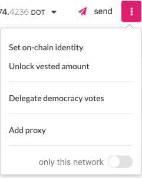

## What is SEL?

DOT is the native token of the Selendra network in a similar way that BTC is the native token of
Bitcoin or Ether is the native token of the Ethereum blockchain.

### The Planck Unit

The smallest unit for the account balance on Substrate based blockchains (Polkadot, Kusama, etc.) is
Planck (a reference to [Planck Length](https://en.wikipedia.org/wiki/Planck_length), the smallest
possible distance in the physical Universe). You can compare SEL's Planck to BTC's Satoshi or ETH's
Gwei. Polkadot's native token SEL equals to 1010 Planck and Kusama's native token KSM
equals to 1012 Planck.

### Selendra

| Unit            | Decimal Places | Conversion to Planck   | Conversion to SEL |
| --------------- | -------------- | ---------------------- | ----------------- |
| Planck          | 0              | 1 Planck               | 0.0000000001 SEL  |
| Microdot (uSEL) | 4              | 104 Planck  | 0.0000010000 SEL  |
| Millidot (mSEL) | 7              | 107 Planck  | 0.0010000000 SEL  |
| SEL (SEL)       | 10             | 1010 Planck | 1.0000000000 SEL  |
| Million (MSEL)  | 16             | 1016 Planck | 1,000,000.00 SEL  |

:::

:::

SEL serves three key functions in Selendra:

- to be used for governance of the network,
- to be staked for the operation of the network,
- to be bonded to connect a chain to Polkadot as a parachain.
- as default token to parachain slots

SEL can also serve ancillary functions by being a transferrable token. For example, SEL stored in
the Treasury can be sent to teams working on relevant projects for the SEL network.

### SEL for Governance

The first function of SEL is to entitle holders to control the governance of the platform. Some
functions that are included under the governance mechanism include determining the fees of the
network, the addition or removal of parachains, and exceptional events such as upgrades and fixes to
the Selendra platform.

Selendra will enable any holder of SEL to participate in governance. For details on how holders can
participate in governance, as well as their rights and responsibilities, see the
[governance page](learn-governance.md).

### SEL for Consensus

SEL will be used to facilitate the consensus mechanism that underpins Selendra. For the platform to
function and allow for valid transactions to be carried out across parachains, Selendra will rely on
holders of SEL to play active roles. Participants will put their SEL at risk (via staking) to
perform these functions. The staking of SEL acts as a disincentive for malicious participants who
will be punished by the network by getting their SEL slashed. The SEL required to participate in the
network will vary depending on the activity that is being performed, the duration the SEL will be
staked for, and the total number of SEL staked. For more information about staking on Polkadot visit
[the dedicated staking page](./learn-staking.md).

### SEL for Parachain Slot Accession

SEL will have the ability to be locked for a duration in order to secure a parachain slot in the
network. The SEL will be reserved during the slot lease and will be released back to the account
that reserved them after the duration of the lease has elapsed and the parachain is removed. You can
learn more about this aspect by reading about the [auctions](learn-auction.md) that govern parachain
slots.

### Vesting

SEL may have a lock placed on them to account for vesting funds. Like other types of locks, these
funds cannot be transferred but can be used in other parts of the protocol such as voting in
governance or being staked as a validator or nominator.

Vesting funds are on a linear release schedule and unlock a constant number of tokens at each block.
Although the tokens are released in this manner, it does not get reflected on-chain automatically
since locks are [lazy](#lazy-vesting) and require an extrinsic to update.

There are two ways that vesting schedules can be created.

- One way is as part of the genesis configuration of the chain. In the case of Selendra,
  the chain specification genesis script reads the state of the Selendra Claims contract that exists
  on the Ethereum blockchain and creates vesting schedules in genesis for all the allocations
  registered as being vested.
- A second way is through an extrinsic type available in the Vesting pallet, `vested_transfer`. The
  vested transfer function allows anyone to create a vesting schedule with a transfer of funds, as
  long as the account for which the vesting schedule will be created does not already have one and
  the transfer moves at least `MinVestedTransfer` funds, which is specified as a chain constant.

Vesting schedules have three parameters, `locked`, `per_block`, and `starting_block`. The
configuration of these three fields dictates the amount of funds that are originally locked, the
slope of the unlock line and the block number for when the unlocking begins.

#### Lazy Vesting

Like [simple payouts](learn-simple-payouts.md), vesting is _lazy_, which means that someone must
explicitly call an extrinsic to update the lock that is placed on an account.

- The `vest` extrinsic will update the lock that is placed on the caller.
- The `vest_other` will update the lock that is placed on another "target" account's funds.

These extrinsics are exposed from the Vesting pallet.

If you are using Selendra-Portal, when there are SEL available to vest for an account, then you will
have the ability to unlock SEL which has already vested from the
[Accounts](https://portal.selendra.org/#/accounts) page.

#### Calculating When Vesting SEL Will Be Available

Generally, you should be able to see from the [Accounts](https://portal.selendra.org/#/accounts) by
looking at your accounts and seeing when the vesting will finish. However, some SEL vest with
"cliffs" - a single block where all the SEL are released, instead of vesting over time. In this
case, you will have to query the chain state directly to see when they will be available (since
technically, the vesting has not yet started - all of the vesting will occur in a single block in
the future).

1. Navigate to the
   [Chain State](https://portal.selendra.org/?rpc=wss%3A%2F%2Frpc.selendra.org#/chainstate) page on
   Portal-UI.
2. Query chain state for `vesting.vesting(ACCOUNT_ID)`
3. Note the `startingBlock` where the unlock starts, and how much SEL is unlocked per block
   (`perBlock`).
4. You will have to calculate the result into “human time". To do this, remember that there are
   approximately 14’400 blocks per day, and you can see what the latest block is shown on the
   [Explorer](https://portal.selendra.org/?rpc=wss%3A%2F%2Frpc.selendra.org#/explorer) page.

## Obtaining Testnet Tokens

TSEL are required to make transactions on the Selendra network. Tokens on Selendra's Testnets
do not have any value besides allowing you to experiment with the features on the
network.

### Getting Tokens on the Selendra Testnet

Selendra's testnet token is called [TSEL](../maintain/maintain-networks.md#selendra-test-network) and
you can obtain its native tokens (called TSEL!) by going to our [Selendra Test Network Faucet](https://faucet.selendra.org).

You can also earn TSELs as rewards by [becoming a validator](learn-validator.md) on Selendra Testnet.
Watch the video below on how to get started on Selendra Testnet.

[

| Unit            | Decimal Places | Conversion to Planck   | Conversion to TSEL  |
| --------------- | -------------- | ---------------------- | ------------------ |
| Planck          | 0              | 1 Planck               | 0.000000000001 TSEL |
| Point           | 3              | 103 Planck  | 0.000000001000 TSEL |
| MicroWND (uTSEL) | 6              | 106 Planck  | 0.000001000000 TSEL |
| MilliWND (mTSEL) | 9              | 109 Planck  | 0.001000000000 TSEL |
| SEL             | 12             | 1012 Planck | 1.000000000000 TSEL |

## Selendra Mainnet SEL

Selendra Mainnet SEL are not freely given away. You can obtain `SEL` either by airdrop or purchase it from DEX.

