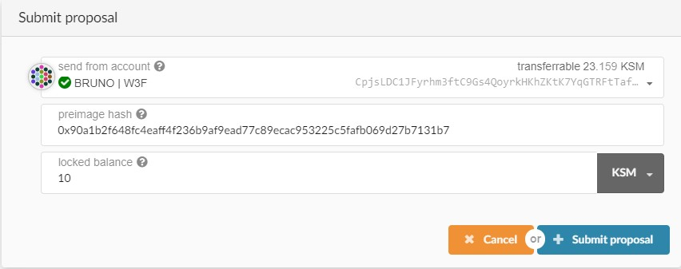

import RPC from "./../../components/RPC-Connection";

{{ selendra: Selendra :selendra }} provides a naming system that allows
participants to add personal information to their on-chain account and subsequently ask for
verification of this information by [registrars](#registrars).

## Setting an Identity

Users can set an identity by registering through default fields such as legal name, display name,
website, Twitter handle, Riot handle, etc. along with some extra, custom fields for which they would
like attestations (see [Judgements](#judgements)).

Users must reserve funds in a bond to store their information on chain:
{{ selendra: <RPC network="selendra" path="consts.identity.basicDeposit" defaultValue={202580000000} filter="humanReadable"/> :selendra }}
and
{{ selendra: <RPC network="selendra" path="consts.identity.fieldDeposit" defaultValue={660000000} filter="humanReadable"/> :selendra }}
per each field beyond the legal name. These funds are _locked_, not spent - they are returned when
the identity is cleared.

These amounts can also be extracted by querying constants through the
[Chain state constants](https://portal.selendra.org/#/chainstate/constants) tab on Selendra-Portal
Apps.

:::info Instructions for setting and clearing Identities

> > Explain how to clear Indentities

:::

:::note

The Ledger app doesn't support the extrinsic for setting identity yet. As a workaround, create a
primary identity with an on-chain account and then using that primary identity, assign a
[sub-identity](#sub-accounts) to the Ledger stash.

:::

### Format Caveat

Please note the following caveat: because the fields support different formats, from raw bytes to
various hashes, a UI has no way of telling how to encode a given field it encounters. The
Selendra-Portal UI currently encodes the raw bytes it encounters as UTF8 strings, which makes these
values readable on-screen. However, given that there are no restrictions on the values that can be
placed into these fields, a different UI may interpret them as, for example, IPFS hashes or encoded
bitmaps. This means any field stored as raw bytes will become unreadable by that specific UI. As
field standards crystallize, things will become easier to use but for now, every custom
implementation of displaying user information will likely have to make a conscious decision on the
approach to take, or support multiple formats and then attempt multiple encodings until the output
makes sense.

## Judgements

After a user injects their information on chain, they can request judgement from a registrar. Users
declare a maximum fee that they are willing to pay for judgement, and registrars whose fee is below
that amount can provide a judgement.

When a registrar provides judgement, they can select up to six levels of confidence in their
attestation:

- Unknown: The default value, no judgement made yet.
- Reasonable: The data appears reasonable, but no in-depth checks (e.g. formal KYC process) were
  performed (all the currently verified identities on-chain).
- Known Good: The registrar has certified that the information is correct (this step involves
  verification of state issued identity documents, and at the moment no account has known good
  identity, with the exception of registrars).
- Out of Date: The information used to be good, but is now out of date.
- Low Quality: The information is low quality or imprecise, but can be fixed with an update.
- Erroneous: The information is erroneous and may indicate malicious intent.

A seventh state, "fee paid", is for when a user has requested judgement and it is in progress.
Information that is in this state or "erroneous" is "sticky" and cannot be modified; it can only be
removed by the complete removal of the identity.

Registrars gain trust by performing proper due diligence and would presumably be replaced for
issuing faulty judgements.

To be judged after submitting your identity information, go to the
[Extrinsics tab in the Selendra-Portal UI](https://portal.selendra.org/#/extrinsics) and select the
`identity` pallet, then `requestJudgement`. For the `reg_index` put the index of the registrar you
want to be judged by, and for the `max_fee` put the maximum you're willing to pay for these
confirmations.

If you don't know which registrar to pick, first check the available registrars by going to
[Chain State tab in the Selendra-Portal UI](https://portal.selendra.org/#/chainstate) and selecting
`identity.registrars()` to get the full list.

:::info Instructions for requesting and cancelling Identity judgements

> > Info about requesting and canceling Identity judgements

:::

## Registrars

Registrars can set a fee for their services and limit their attestation to certain fields. For
example, a registrar could charge {{ selendra: 1 SEL :selendra }} to
verify one's legal name, email, and GPG key. When a user requests judgement, they will pay this fee
to the registrar who provides the judgement on those claims. Users set a maximum fee they are
willing to pay and only registrars below this amount would provide judgement.

### Becoming a Registrar

To become a registrar, submit a pre-image and proposal into
[Democracy](../maintain/maintain-guides-democracy.md), then wait for people to vote on it. For best
results, write a post about your identity and intentions beforehand, and once the proposal is in the
queue ask people to endorse it so that it gets ahead in the referendum queue.

Here's how to submit a proposal to become a registrar:

Go to the Democracy tab, select "Submit preimage", and input the information for this motion -
notably which account you're nominating to be a registrar in the `identity.setRegistrar` function.

Copy the preimage hash. In the above image, that's
`0x90a1b2f648fc4eaff4f236b9af9ead77c89ecac953225c5fafb069d27b7131b7`. Submit the preimage by signing
a transaction.

Next, select "Submit Proposal" and enter the previously copied preimage hash. The `locked balance`
field needs to be at least
{{ selendra: <RPC network="selendra" path="consts.identity.basicDeposit" defaultValue={202580000000} filter="humanReadable"/>. :selendra }}
You can find out the minimum by querying the chain state under
[Chain State](https://portal.selendra.org/#/chainstate) -> Constants -> democracy ->
minimumDeposit.

At this point, SEL holders can endorse the motion. With enough endorsements, the motion will become
a referendum, which is then voted on. If it passes, users will be able to request judgement from
this registrar.

### Current Registrars

There are multiple registrars on {{ selendra: Selendra :selendra }}.
Unless no additional information is available here, you must reach out to specific registrars
individually if you want to be judged by those.

Registrar 0:   **URL**: https://registrar.selendra.org/   **Account**:
{{ selendra: H4XieK3r3dq3VEvRtqZR7wN7a1UEkXxf14orRsEfdFjmgkF,    :selendra }}
**Fee**: 0.04 SEL

> > WORK IN PROGRESS

## Sub Accounts

Users can also link accounts by setting "sub accounts", each with its own identity, under a primary
account. The system reserves a bond for each sub account. An example of how you might use this would
be a validation company running multiple validators. A single entity, "My Staking Company", could
register multiple sub accounts that represent the [Stash accounts](learn-keys.md) of each of their
validators.

An account can have a maximum of 100 sub-accounts. Note that a deposit of
{{ selendra: <RPC network="selendra" path="consts.identity.subAccountDeposit" defaultValue={200530000000} filter="humanReadable"/> :selendra }}
is required for every sub-account.

:::info Explainer article and video on setting sub-identities

Here is the
[how to set sub-identities](https://support.polkadot.network/support/solutions/articles/65000181991-how-to-set-identities-for-sub-accounts)
article and a [video tutorial](https://www.youtube.com/watch?v=0Yh1JYg3ZKU) on setting
sub-identities using Selendra-Portal UI

:::

## Clearing and Killing an Identity

**Clearing:** Users can clear their identity information and have their deposit returned. Clearing
an identity also clears all sub accounts and returns their deposits.

:::info Visit the section "Clear an Identity" on
[this support article](https://support.polkadot.network/support/solutions/articles/65000181981) for
guidelines about clearing identities.

:::

**Killing:** The Council can kill an identity that it deems erroneous. This results in a slash of
the deposit.
