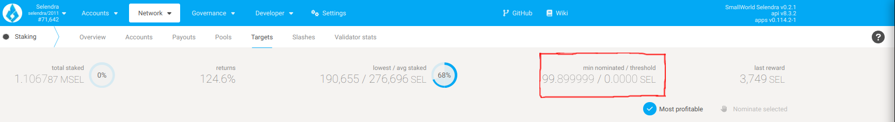

import RPC from "./../../components/RPC-Connection";

:::tip New to Staking?

Start your staking journey or explore more information about staking on
[Selendra's Home Page](https://selendra.org/staking/). Discover the new
[Staking Dashboard](https://staking.selendra.org/#/overview) that makes staking much easier and
check this
help you get started. 

:::

Nominators secure the Relay Chain by selecting good validators and staking SEL.

You may have an account with SEL and want to earn fresh SEL. You could do so as validator, which
requires a node running 24/7. If you do not have such node or do not want to bother, you can still
earn SEL by nominating one or more validators.

By doing so, you become a nominator for the validator(s) of your choice. Pick your validators
carefully - if they do not behave properly, they will get slashed and you will lose SEL as well.
However, if they do follow the rules of the network, then you can share in staking rewards that they
generate.

While your SEL are staked by nominating a validator, they are 'locked' (bonded). You can receive new
SEL in your account but you cannot stake as validator or transfer SEL away from your account. You
can [un-nominate at any time](../maintain/maintain-guides-how-to-unbond.md) to stop staking your
funds. Keep in mind that the un-nomination is effective in the next era, and that un-nominating does
not automatically unbond your funds. There is an unbonding period of 28 days on
Polkadot before bonded funds can be transferred after issuing an unbond transaction.

### Active vs. Inactive Nomination

When you go to the [Account actions](https://portal.selendra.org/#/staking/actions) under staking
page, you should see your bonded accounts and nomination status. If not, you can follow
[this](../maintain/maintain-guides-how-to-nominate-selendra.md) guide to configure it first. Your
nominations will be effective in the next era; eras are roughly 24 hours on
Selendra.

Suppose you have nominated five validator candidates, and three out of five were elected to the
active validator set, then you should see two of your nominations as "waiting", and most likely one
as "active" and the rest as "inactive". Active or inactive nomination means your nominated
validators have been elected to be in the validator set, whereas waiting means they did not get
elected. Generally, you will only have a single validator have an active nomination, which means
that you are directly supporting it with your stake this era and thus potentially receiving staking
rewards. Inactive nominators were validators that were elected for this era but which you are not
actively supporting. Every era, a new election will take place and you may be assigned a different
active nomination from among the validators you have selected.

If you are committing a very large amount of stake, then you may have more than one active
nomination. However, the election algorithm attempts to minimize this situation, and it should not
occur often, so you should almost always see only a single active nomination per era. See the
[section on Phragmén optimization](learn-phragmen.md#optimizations) for more details.

### Minimum Active Nomination to Receive Staking Rewards

:::info Minimum SEL required to earn staking rewards

Minimum SEL required to submit intent to nominate is 10 SEL, but the minimum active nomination
required to earn staking rewards is dynamic and may be much higher, which can be viewed on
[Selendra Portal > Network > Staking > Targets page](https://portal.selendra.org/#/staking/targets).

:::

Bonding additional tokens or unbonding the staked tokens will automatically place the nominating
account in the appropriate bag. While the system tries its best to ensure nominators are always
represented in the correct bag, certain changes in bonded funds (e.g. a slash in the negative
direction, or rewards in the positive direction) can cause an account to be in the wrong bag, and
for scalability reasons the system will not automatically self-adjust.

## WORK IN PROGRESS