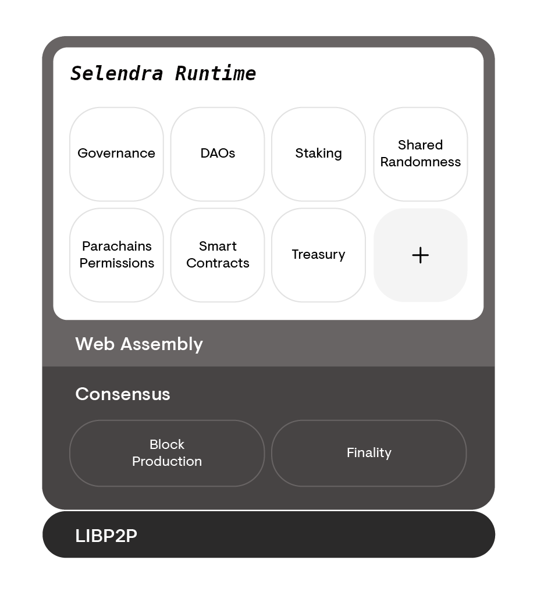

The architecture of Selendra can be divided into two different parts, the Selendra _runtime_ and the
Selendra _host_. The Selendra runtime is the core state transition logic of the chain and can be
upgraded over the course of time and without the need for a hard fork. In comparison, the Selendra
host is the environment in which the runtime executes and is expected to remain stable and mostly
static over the lifetime of Selendra.

The Selendra host interacts with the Selendra runtime in limited, and well-specified ways. For this
reason, implementation teams can build an alternative implementation of the Selendra host while
treating the Selendra runtime as a black box. For more details of the interactions between the host
and the runtime, please see the [specification][].

## Components of the Selendra host

- Networking components such as Libp2p that facilitates network interactions.
- State storage and the storage trie along with the database layer.
- Consensus engine for GRANDPA and BABE.
- Wasm interpreter and virtual machine.
- Low level primitives for a blockchain, such as cryptographic primitives like hash functions.

A compiled Selendra runtime, a blob of Wasm code, can be uploaded into the Selendra host and used as
the logic for the execution of state transitions. Without a runtime, the Selendra host is unable to
make state transitions or produce any blocks.

## Diagram

Below is a diagram that displays the Selendra host surrounding the Selendra runtime. Think of the
runtime (in white) as a component that can be inserted, swapped out, or removed entirely. While the
parts in grey are stable and can not change without an explicit hard fork.

