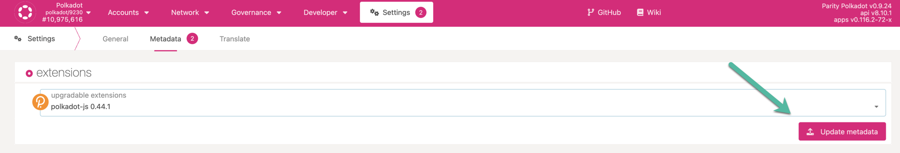
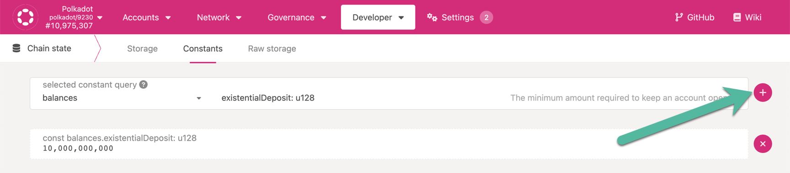

<!-- This page is a WIP -->
<!-- The first version of this page takes motivation from Emre's ELI5 on Selendra-JS -->

Selendra-JS is a collection of tools that interfaces with the Selendra blockchain in a granular way.

## Primary Implementation

Selendra-JS as a term has multiple moving parts that are worth mentioning.

### [Selendra-JS UI](https://js.selendra.org/)

The Selendra-JS UI is a hosted application that loads in your browser. The UI has a standard DNS
hosted version, which always has the latest features, and an IPFS version that is less frequently
updated but is more decentralized. This is also often referred to as Selendra-JS Apps, or the Apps
UI.

Selendra-JS Apps has many capabilities that go beyond basic wallet functions such as account
creation and sending or receiving transactions.

### [Selendra-JS Extension](https://js.selendra.org/extension/)

The extension is a simple tool for managing accounts in a browser extension and allowing the signing
of extrinsics using these accounts. The Selendra-JS extension is not made for users to interact with
on-chain functions as one would find through a wallet app. The extension acts as a robust key-store
and thus acts as an account manager for Substrate-based accounts.

However, it also provides a simple interface for interacting with extension-compliant dApps.

Ensure that the Selendra-JS Extension installed is updated with the latest metadata of the chain.
You would notice these updates under Settings > Metadata. Click on Update metadata and approve the
update.

#### [Selendra-JS Phishing List](https:/js.selendra.org/phishing/)

The phishing list website is a community-driven curation of less-than-honest operators. The
Selendra-JS extension uses this list to warn a user about suspicious URLs and addresses that are
part of the list, and automatically blocks the account address.

### [Selendra-JS API](https://github.com/selendra/selendrajs-api)

A JavaScript API allowing for programs to interface with the functionality of Selendra.

## Selendra-JS Apps

Selendra-JS Apps is the native Selendra/Substrate UI for interacting with a node, allowing
access to all features available on Substrate chains. Selendra-JS Apps also allows developers to to
interface with a local node.

> Note that the UI may not precisely align with the functionality of individual parachains.

Among other things, Selendra-JS Apps allows a user to:

- [Staking](learn-staking.md)
- [Governance](learn-governance.md)
- [Auctions](learn-auction.md)
- Query chain metadata
- Query on-chain data using RPC calls
- Call extrinsics using your account

### Developers

A developer can utilize Selendra-JS Apps to test your code's functionality. Interacting with the
Selendra-JS comes down to either querying on-chain data or issuing an extrinsic.

#### Querying on-chain data

To populate the Apps UI, the web app queries the Selendra-JS API. The API then queries a Polkadot
node and uses JavaScript to return information that the UI will display on the screen. You can
choose which node to connect to by changing it in the upper-left-hand corner of the screen.

Let's see how we can query on-chain data with Polkadot JS Apps on Polkadot network with an example.
To find out the current value for existential deposit, navigate to Developer > Chain state >
Constants and query the balances pallet for existential deposit as shown in the snapshot below. You
need to click on the plus button to execute the query. The value displayed is in
[plancks](learn-DOT#polkadot)

#### Issuing an extrinsic

Extrinsics are pieces of information that come from outside the chain and are included in a block.
Extrinsics can be one of three types: inherents, signed, and unsigned transactions.

Most extrinsics displayed on Selendra-JS Apps are signed transactions. Inherits are non-signed and
non-gossiped pieces of information included in blocks by the block author, such as timestamps, which
are “true” because a sufficient number of validators have agreed about validity.

Unsigned transactions are information that does not require a signature but will require some sort
of spam prevention, whereas signed transactions are issued by the originator account of a
transaction which contains a signature of that account, which will be subject to a fee to include it
on the chain.

### Considerations

For more user-friendly wallets, check out the supported and treasury-funded wallets on the
[Wallets Page](../build/build-wallets.md)

## Resources

### Beginner's Guide to Selendra-JS

- [Introduction to Selendra-JS](https://www.youtube.com/watch?v=4EQqwGFV1D8)
- [Create an account using Selendra-JS](https://www.youtube.com/watch?v=sy7lvAqyzkY)
- [Network Explorer on Selendra-Portal UI](https://www.youtube.com/watch?v=g4b4IWR6OrE)

### Documentation

- [Official polkadot{.js} docs](https://selendra.js.org/docs/)
- [Substrate docs on Selendra-JS](https://docs.substrate.io/reference/command-line-tools/polkadot-apps/)
