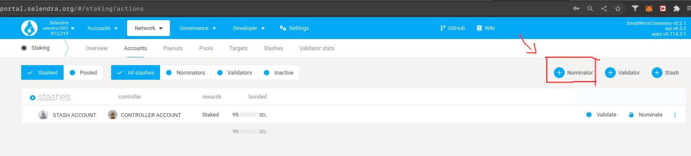
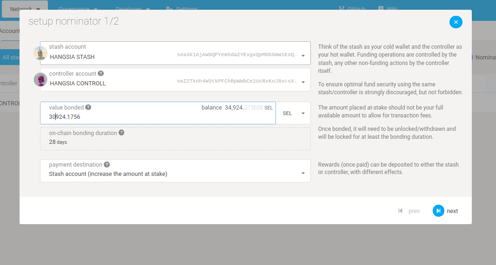
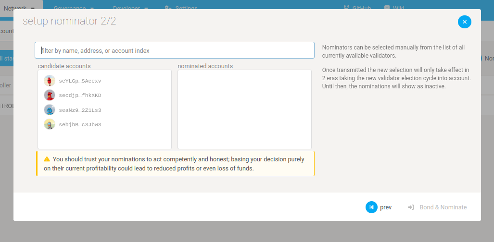
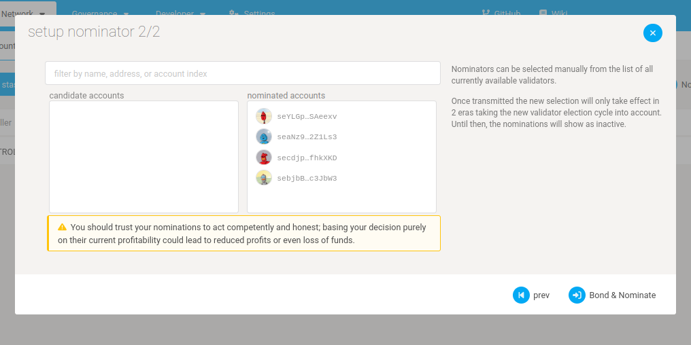
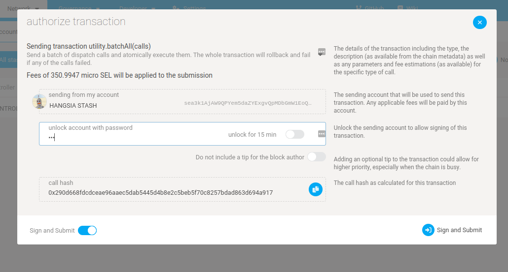
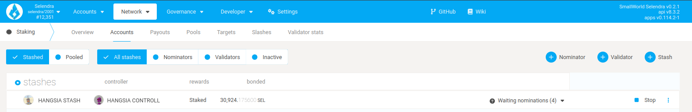

import RPC from "./../../components/RPC-Connection";

:::tip New to Staking?

Start your staking journey or explore more information about staking on
[Selendra's Home Page](https://selendra.org/staking/). Discover the new
[Staking Dashboard](https://staking.selendra.org/#/overview) that makes staking much easier.
:::

Nominators are one type of participant in the staking subsystem of Selendra. They are responsible
for appointing their stake to the validators who are the second type of participant. By appointing
their stake, they are able to elect the active set of validators and share in the rewards that are
paid out.

While the [validators][] are active participants in the network that engage in the block production
and finality mechanisms, nominators take a slightly more passive role. Being a nominator does not
require running a node of your own or worrying about online uptime. However, a good nominator
performs due diligence on the validators that they elect. When looking for validators to nominate, a
nominator should pay attention to their own reward percentage for nominating a specific validator -
as well as the risk that they bear of being slashed if the validator gets slashed.

## Setting up Stash and Controller keys

Nominators are recommended to set up separate stash and controller accounts. Explanation and
reasoning for generating distinct accounts for this purpose is elaborated in the [keys][] section of
the Wiki.

You can generate your stash and controller account via any of the recommended methods that are
detailed on the [account generation][] page.

## Using Selendra-Portal

### Step 1: Bond your tokens

On the [Selendra-Portal](https://portal.selendra.org) navigate to the "Staking" tab (within the
"Network" menu).

The "Staking Overview" subsection will show you all the active validators and their information -
their identities, the amount of SEL that are staking for them, amount that is their own provided
stake, how much they charge in commission, the era points they've earned in the current era, and the
last block number that they produced. If you click on the chart button it will take you to the
"Validator Stats" page for that validator that shows you more detailed and historical information
about the validator's stake, rewards and slashes.

The "Account actions" subsection ([link](https://portal.selendra.org/#/staking/actions)) allows you
to stake and nominate.

The "Payouts" subsection ([link](https://portal.selendra.org/#/staking/payouts)) allows you to
claim rewards from staking.

The "Targets" subsection ([link](https://portal.selendra.org/#/staking/targets)) will help you
estimate your earnings and this is where it's good to start picking favorites. For additional
information on content provided in this table checkout
[What to take into consideration when nominating](learn-nominator#what-to-take-into-consideration-when-nominating).

The "Waiting" subsection ([link](https://portal.selendra.org/#/staking/waiting)) lists all pending
validators that are awaiting more nominations to enter the active validator set. Validators will
stay in the waiting queue until they have enough SEL backing them (as allocated through the
[Phragmén election mechanism](../learn/learn-phragmen.md)). It is possible validator can remain in
the queue for a very long time if they never get enough backing.

The "Validator Stats" subsection ([link](https://portal.selendra.org/#/staking/query)) allows you
to query a validator's stash address and see historical charts on era points, elected stake,
rewards, and slashes.

Pick "Account actions", then click the "+ Nominator" button.

Select a "value bonded" that is **less** than the total amount of SEL you have, so you have some
left over to pay transaction fees. Transaction fees are currently around 0.01 SEL, but they are
dynamic based on a variety of factors including the load of recent blocks.

Also be mindful of the reaping threshold - the amount that must remain in an account lest it be
burned. That amount is 1 SEL on Selendra, so it's recommended to keep at least 1.5 SEL in your
account to be on the safe side.

Choose whatever payment destination that makes sense to you. If you're unsure, you can choose "Stash
account (increase amount at stake)" to simply accrue the rewards into the amount you're staking and
earn compound interest.

:::note 
In case you don't understand, you can just follow the photo below:
:::

### Step 2: Nominate a validator

You are now bonded. Being bonded means your tokens are locked and could be
[slashed](../learn/learn-staking.md#slashing) if the validators you nominate misbehave. All bonded
funds can now be distributed to up to
{{ selendra: <RPC network="selendra" path="consts.staking.maxNominations" defaultValue={16}/> :selendra }}
validators. Be careful about the validators you choose since you will be slashed if your validator
commits an offence.

Assuming at least one of your nominations ends up in the active validator set, you will start to get
rewards allocated to you. In order to claim them (i.e., add them to your account), you must manually
claim them. See the [Claiming Rewards](../learn/learn-staking.md#claiming-rewards) section of the
Staking wiki page for more details.

### Step 3: Stop nominating

At some point, you might decide to stop nominating one or more validators. You can always change who
you're nominating, but you cannot withdraw your tokens unless you unbond them. Detailed instructions
are available [here](maintain-guides-how-to-unbond.md).

[validators]: maintain-guides-how-to-validate-selendra.md
[keys]: ../learn/learn-keys.md###"controller"-and-"stash"-keys
[account generation]: ../learn/learn-account-generation.md
