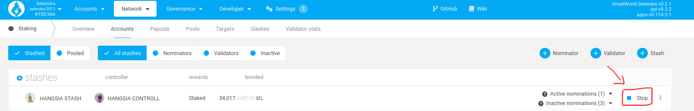
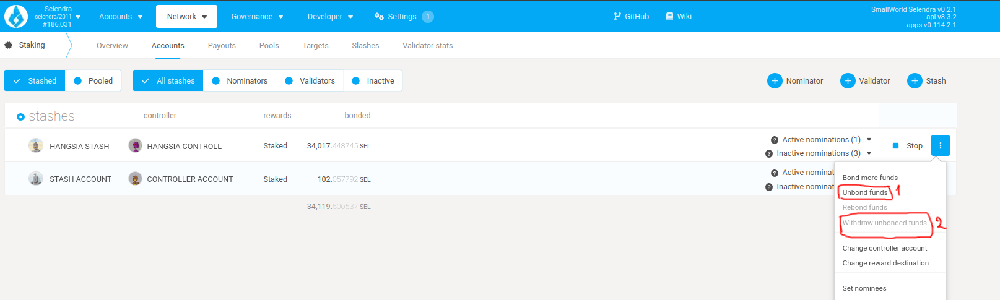
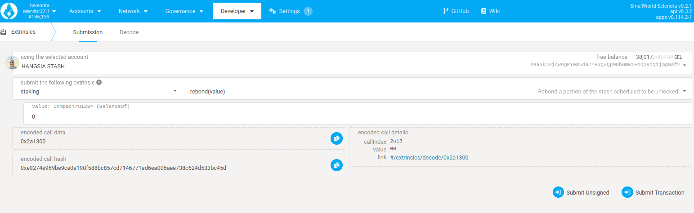

The following content describes how to stop nominating or validating and retrieve your stake. Please
note that all networks on which you can nominate have a delayed exit period, called the _unbonding
period_, which serves as a cooldown. You will not be able to transfer your tokens before this period
has elapsed, and you will not receive any staking rewards during this period (as you are not
nominating any validators).

#### Step 1: Stop nominating

Go to [Selendra Portal](https://portal.selendra.org/#/staking/actions) staking section.

Click on _Stop_ button to stop nominating.

After you confirm this transaction, your tokens will still remain _bonded_. This means they stay ready to be distributed among nominees or used as validator self-stake again. To actually withdraw them, you need to unbond.

#### Step 2: Unbonding an amount

To unbond the amount, click the three dots next to the account you want to unbond tokens for, and select "Unbond funds".

Select the amount you wish to unbond and click Unbond, then confirm the transaction. If successful, your balance will show as "unbonding" with an indicator of how many more blocks remain until the amount is fully unlocked.

The duration of unbonding on Selendra is the same as Polkadot which is 28 days.

Once this process is complete, you will have to issue another, final transaction: Withdraw Unbonded, which will be available in the same pop-up. You can also check how long you have to wait in order to withdraw your stake in the Accounts page by expanding your account balance. There is a tiny icon beside the word "unbonding" that will eventually become an unlock icon once the remaining blocks get passed.

Then, you can click that icon directly to submit the withdraw transaction. Finally, your transferrable balance will increase by the amount of tokens you've just fully unbonded.

### Rebonding before the end of the unbonding period

In case you want to rebonding your tokens before the unbonding period is over, you can do this by issuing a `rebond` extrinsic. This allows you to bond your tokens that are still locked without waiting until the end of the unbonding period.

In order to do this, you will need to issue an extrinsic manually from Selendra Portal. [Click on this link](https://portal.selendra.org/#/extrinsics) to go to Selendra Portal's extrinsic sections.

Select the "staking" pallet and the "rebond" extrinsic. Enter the amount of tokens that are currently locked in unbonding that you want to rebond in "value". Then click "Submit Transaction".

Confirm the transaction in the next pop-up. Once the transaction is included in the next block your tokens will be rebonded again and you can start staking with them.