:::

## Preliminaries

Running a validator on a live network is a lot of responsibility! You will be accountable for not
only your own stake, but also the stake of your current nominators. If you make a mistake and get
slashed, your money and your reputation will be at risk. However, running a validator can also be
very rewarding, knowing that you contribute to the security of a decentralized network while growing
your stash.

:::warning

It is highly recommended that you have significant system administration experience before
attempting to run your own validator.

You must be able to handle technical issues and anomalies with your node which you must be able to
tackle yourself. Being a validator involves more than just executing the Selendra binary.

:::

## How many SEL do I need?
To be elected into the set, you will need a minimum stake behind your validator.
This stake can come from yourself or from nominators. This means that as minimum, you will need enough SEL to setup Stash and Controller accounts with enough tokens, plus some extra token for transaction fees. The rest can come from nominators.

:::warning
 Any SEL that you stake for your validator is liable to be slashed, meaning that an insecure or improper setup may result in loss of SEL tokens! If you are not confident in your ability to run a validator node, it is recommended to nominate your SEL to a trusted validator node instead.
:::

## Prerequisites
### Reference Hardware

- CPU
    - x86-64 compatitable;
    - Intel Ice Lake, or newer (Xeon or Core series); AMD Zen3, or newer (EPYC or Ryzen);
    - 4 physical cores @ 3.4GHz;
    - Simultaneous multithreading disabled (Hyper-Threading on Intel, SMT on AMD)
    - Prefer single-threaded performance over higher cores count.

- Storage
    - An NVMe SSD of 1 TB (As it should be reasonably sized to deal with blockchain growth). In general, the latency is more important than the throughput. 

- Memory
    - 16GB DDR4 ECC.

- System
    - Linux Kernel 5.16 or newer.

- Network
    - The minimum symmetric networking speed is set to 500 Mbit/s (= 62.5 MB/s). This is required to support a large number of parachains and allow for proper congestion control in busy network situations.

:::note
The specs posted above are not a hard requirement to run a validator, but are considered best practice. Running a validator is a responsible task; using professional hardware is a must in any way.
:::

## Configure Network Time Protocl(NTP) Client

NTP is a networking protocol designed to synchronize the clocks of computers over a network. NTP allows you to synchronize the clocks of all the systems within the network. Currently it is required that validator's local clocks stay reasonably in sync, so you should be running NTP or a similar
service. You can check whether you machine have NTP client preinstalled or not by running:

```bash
timedatectl
```

If NTP is installed and running, you should see `System clock synchronized: yes` (or a similar message). If you do not see it, you can install it by executing:

If you are using Ubuntu, Run the following command:
```bash
sudo apt install ntp
```

If you are using KOOMPI OS(Arch Linux), Run the following command:
```bash
sudo pacman -S ntp
```

## Installing Selendra Binary

Currently, you can download Selendra binary using `script`:
```bash
curl -Ssf https://raw.githubusercontent.com/selendra/selendra/master/scripts/get_selendra.sh && bash get_selendra.sh
```


### Synchronize Chain Data

:::note 
This guide, we create the chain db location at /selendra which mean u need sudo privilege to make it, if u want to follow along u need to run the following step:
:::
```bash
sudo mkdir /selendra # create directory using sudo privilege
```

```bash
sudo chown -R -v $USER /selendra # To change owner directory to current user
```

You can begin syncing your node by running the following command if you do not want to start in validator mode right away by running the binary:

```bash
selendra --base-path /selendra/validator
```

```
2022-11-13 20:52:50 Smallworld Selendra
2022-11-13 20:52:50 ✌️  version 0.2.1-f2a76c68646
2022-11-13 20:52:50 ❤️  by Selendra <admin@selendra.org>, 2017-2021
2022-11-13 20:52:50 📋 Chain specification: selendra
2022-11-13 20:52:50 🏷 Node name: cautious-animal-9621
2022-11-13 20:52:50 👤 Role: FULL
2022-11-13 20:52:50 💾 Database: RocksDb at /root/.local/share/selendra/chains/selendra/db
2022-11-13 20:52:50 ⛓  Native runtime: selendra-2001 (selendra-0.tx3.au1)
2022-11-13 20:52:50 🏷 Local node identity is: 12D3KooWE9hsen3on2oR1h84xSEzaCMKPvNaxk9kCUVmmpazz8x4
2022-11-13 20:52:50 📦 Highest known block at #3567
2022-11-13 20:52:50 〽️ Prometheus server started at 127.0.0.1:9615
2022-11-13 20:52:50 Listening for new connections on 127.0.0.1:9944.
```
:::info EXAMPLE OF NODE SYNC
```
2022-11-13 20:52:50 🔍 Discovered new external address for our node: /ip4/10.26.16.1/tcp/30333/ws/p2p/12D3KkoWLtXFWf1oGrnxMGmPKPW54xWCHaXHbFh4baP6Kxmxoi5u
2022-11-13 20:52:50 ⚙️  Syncing 218.8 bps, target=#1000 (17 peers), best: #1000 (0x08af…dcf5), finalized #1000 (0xd4f0…2642), ⬇ 173.5kiB/s ⬆ 12.7kiB/s
2021-06-17 03:07:45 ⚙️  Syncing 214.8 bps, target=#1001 (20 peers), best: #1120 (0xb272…e800), finalized #1150 (0x94e6…8a9f), ⬇ 134.3kiB/s ⬆ 7.4kiB/s
2021-06-17 03:07:50 ⚙️  Syncing 214.8 bps, target=#1002 (21 peers), best: #1504 (0xe7a5…01a2), finalized #1290 (0xcc29…b1a9), ⬇ 5.0kiB/s ⬆ 1.1kiB/s
2021-06-17 03:07:55 ⚙️  Syncing 138.4 bps, target=#1003 (21 peers), best: #1800 (0xcf4b…6553), finalized #1300 (0xfe6c…eeb0), ⬇ 18.9kiB/s ⬆ 2.0kiB/s
2021-06-17 03:08:00 ⚙️  Syncing 37.0 bps, target=#1004 (22 peers), best: #2540 (0x5b73…6fc9), finalized #2000 (0xfe6c…eeb0), ⬇ 14.3kiB/s ⬆ 4.4kiB/s
```
:::

Depending on the size of the chain when you do this, this step may take anywhere from a few minutes to a few hours.

If you are interested in determining how much longer you have to go, your server logs (printed to STDOUT from the selendra process) will tell you the latest block your node has processed and verified.


## Bond SEL

It is highly recommended that you make your controller and stash accounts be two separate accounts. For this, you will create two accounts and make sure each of them have at least enough funds to pay the fees for making transactions. Keep most of your funds in the stash account since it is meant to be the custodian of your staking funds.

Make sure not to bond all your `SEL` balance since you will be unable to pay transaction fees from your bonded balance.

To start our validator, we will do the following:

- Bond the `SEL` of the Stash Account. These `SEL` will be put at stake for the security of the network and can be slashed.
- Select the  Controller. This is the account that will decide when to start or stop validating.

First, go to the [Selendra Portal's staking section](https://portal.selendra.org/#/staking) section. Click on "Account Actions", and then the "+ Stash" button.

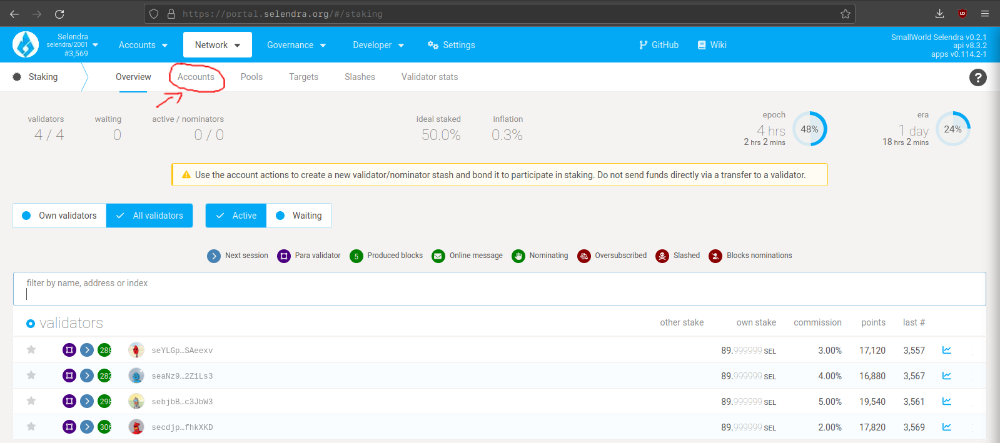
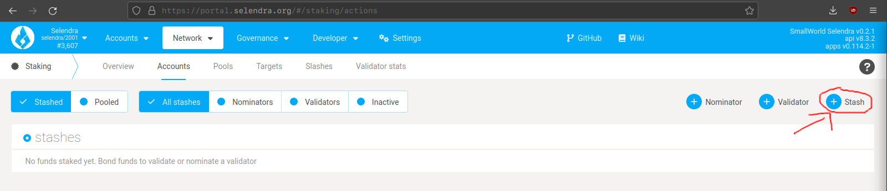
 
- **Stash Account** - Select your Stash account. In this example, we will bond 99 SEL, where the minimum bonding amount is 1. Make sure that your Stash account contains at least this much. You can, of course, stake more than this.
 
- **Controller account** - Select the Controller account that you created. This account will also need a small amount of SEL in order to start and stop validating.
 
- **Value bonded** - How much SEL from the Stash account you want to bond/stake. Note that you do not need to bond all of the SEL in that account. Also note that you can always bond `more` SEL later. However, `withdrawing` any bonded amount requires the duration of the unbonding period. On Selendra, the planned unbonding period is 28 days.

- **Payment destination** - The account where the rewards from validating are sent. If you'd like to redirect payments to an account that is neither the controller nor the stash account, set one up. Note that it is extremely unsafe to set an exchange address as the recipient of the staking rewards.

Once everything is filled in properly, click Bond and sign the transaction with your Stash account.

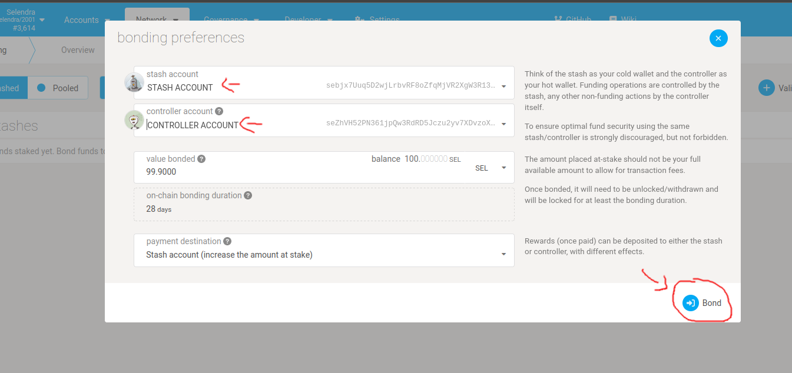
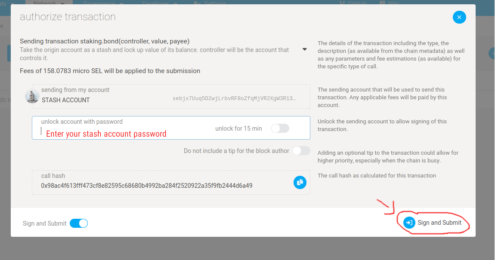

After a few seconds, you should see an **ExtrinsicSuccess** message.

Your bonded account will available under Stashes. You should now see a new card with all your accounts (note: you may need to refresh the screen). The bonded amount on the right corresponds to the funds bonded by the **Stash** account.


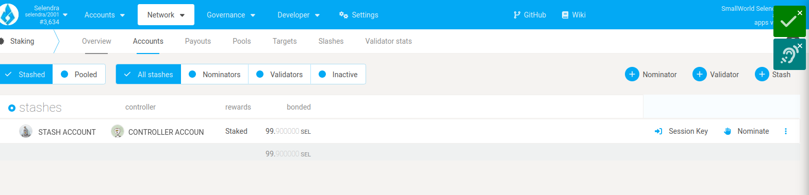

## Set Session Keys

:::caution Session keys are consensus critical

If you are not sure if your node has the current session keys that you made the setKeys transaction then you can use one of the two available RPC methods to query your node:

Once your node is fully synced, stop the process by pressing Ctrl-C. At your terminal prompt, you will now start running the node.
:::

```bash
selendra --validator --base-path /selendra/validator --name "name for the node"
```
You can give your validator any name you like, but note that others will be able to see it, and it is included in the list of all server using the same telemetry server. It is recommended that you choose something likely to be unique.

## Generating the Session Keys

You need to tell the chain your Session keys by signing and submiting an extrinsic. This is what associates your validator node with your Controller account on Selendra.

**Option 1: CLI**

this option requires `websocket` package, you will install it with the following command:

```bash
## KOOMPI OS/Arch Linux
sudo pacman -S websocat
```


```bash
## Debian/Ubuntu
sudo apt install websocat
```

Open another terminal, in the same machine you use to run the binary and run the following command:

```bash
echo '{"id":1,"jsonrpc":"2.0","method":"author_rotateKeys","params":[]}' | websocat -n1 -B 99999999 ws://127.0.0.1:9944
```

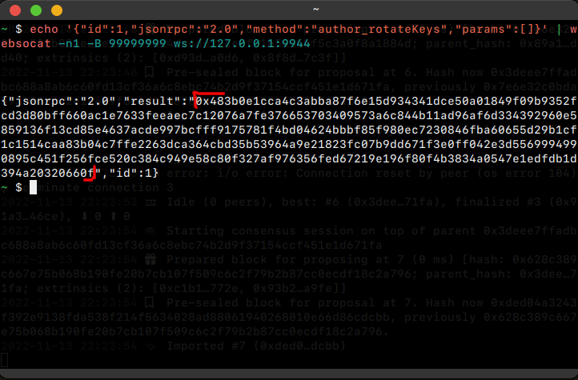

The output will have a hex-encoded "result" field. The result is the concatenation of the four public keys. Save this result for a later step.

:::info 
This is the example of session key, you need to copy 0x7e35ac53f4980033c02f2d9503fb9e69faa79a96713856d136da1361fc8b1c66c00c2461c3028f29c7e08758e741716709d07ab661e3a6209d56d8a334a12f2dd021609b70824d13c04bb07e5a5e39bff45065d147945efaedc68ea5286fe4698045034d58ccaa0e6aacb1bdc2415257a7c5f4b7feb52ad036088fc0956864437a0806396b726f361fe0b0198d8eb9d183cb3284901fa9db36c69bb1c0c17f24a6fce563e9d3e3ad32014eab654a69465040e5f5e59731d3e076663758d7985c
:::
You can restart your node at this point.

## Submitting the setKeys Transaction

You need to tell the chain your Session keys by signing and submitting an extrinsic. This is what associates your validator with your Controller account.

Go to `Staking > Account Actions`, and click "Set Session Key" on the bonding account you generated earlier. Enter the output from `author_rotateKey` in the field and click "Set Session Key".


Submit this extrinsic and you are now ready to start validating.

## Setup via Validator Tab


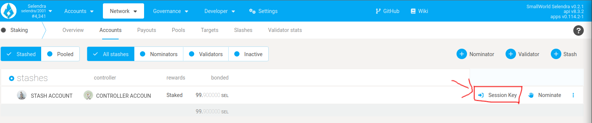


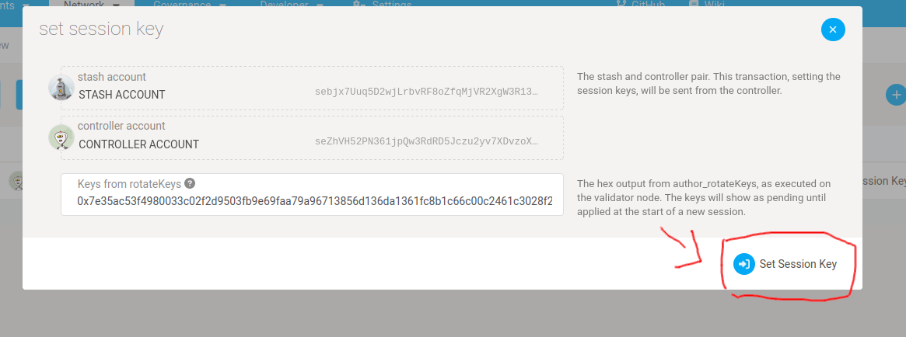

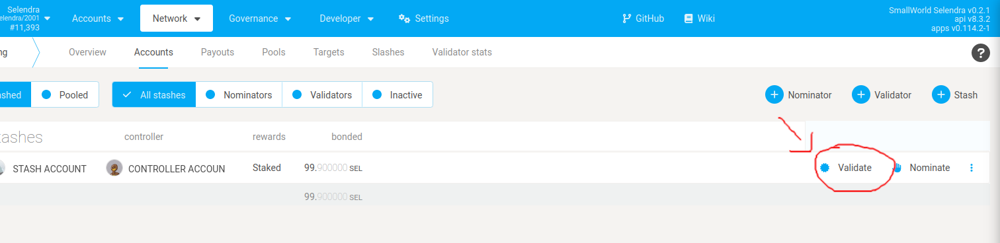

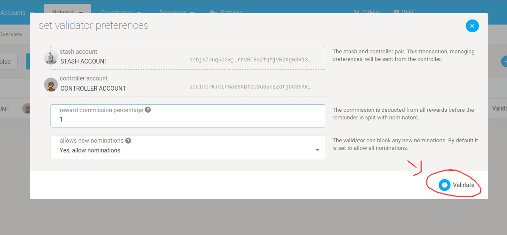

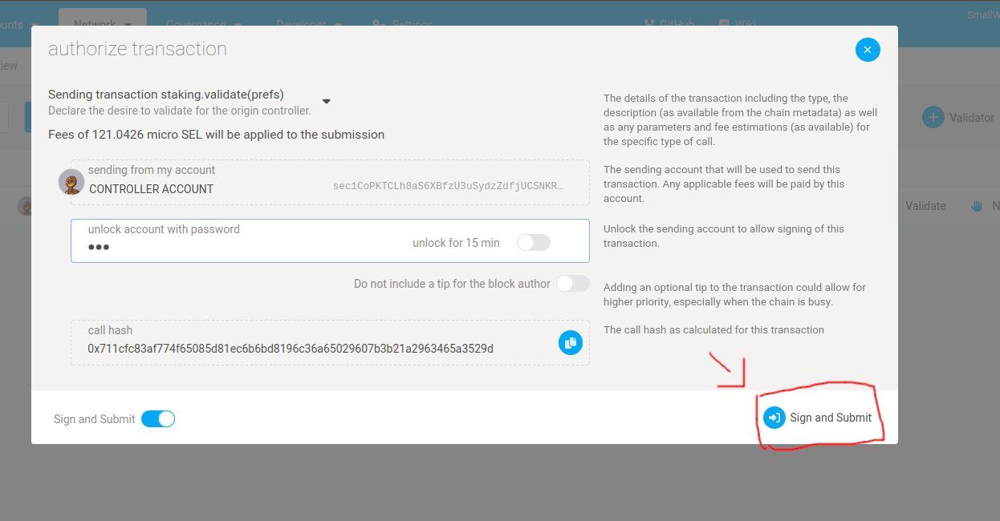

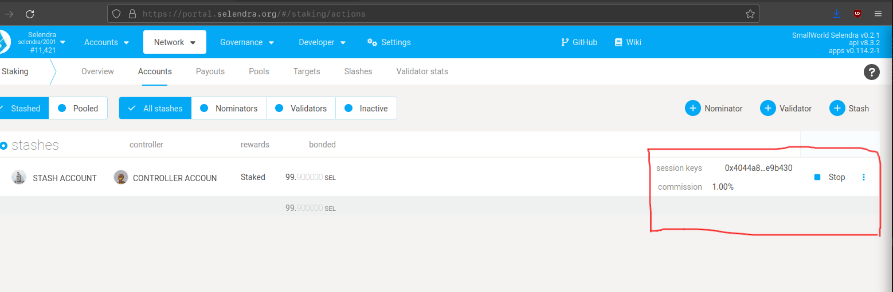

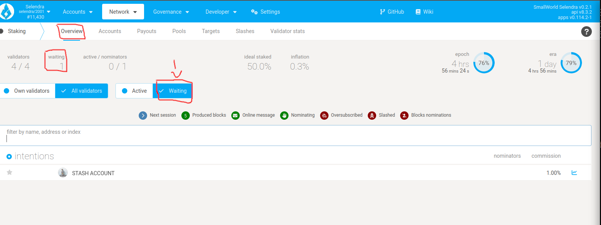


The validator set is refreshed every era. In the next era, if there is a slot available and your node is selected to join the validator set, your node will become an active validator. Until then, it will remain in the waiting queue. If your validator is not selected to become part of the validator
set, it will remain in the waiting queue until it is. There is no need to re-start if you are not selected for the validator set in a particular era. However, it may be necessary to increase the number of SEL staked or seek out nominators for your validator in order to join the validator set.

**Congratulations!** If you have followed all of these steps, and been selected to be a part of the validator set, you are now running a Selendra validator! If you need help, reach out on the [Selendra Community](https://t.me/selendrachain).


**Option 2: WORK IN PROGRESS**


## Setup Systemd Service

If you finished everything above, you can stop your the previous command with **Ctrl+C**:
```bash
selendra --validator --base-path /selendra/validator --name "name for the node" # Ctrl-C
```

After you stop the process, you can enable selendra systemd service by running:
```bash
sudo systemctl enable --now selendra.service
```

To verify if the service is running:
```bash
sudo systemctl status selendra.service
```

:::note
If you cant get systemd to work, please go to the using systemd [section](maintain-guides-how-to-systemd.md).
:::
