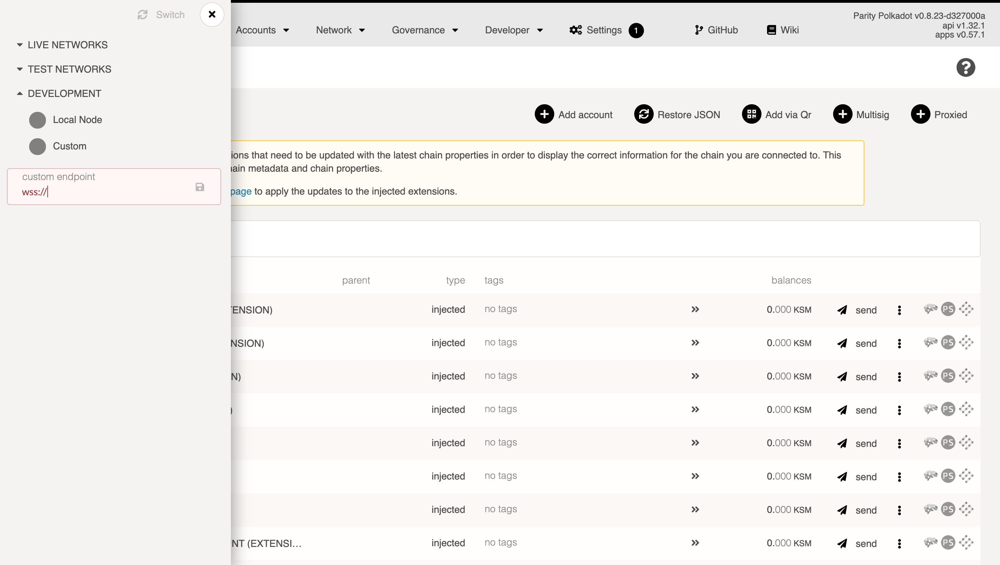

You might want to host a node on one server and then connect to it from a UI hosted on another, e.g.
[Selendra-Portal](https://portal.selendra.org). This will not be possible unless you set up a secure
proxy for websocket connections. Let's see how we can set up WSS on a remote Substrate node.

_Note: this should **only** be done for sync nodes used as back-end for some dapps or projects.
Never open websockets to your validator node - there's no reason to do that and it can only lead to
security gaffes._

In this guide we'll be using Ubuntu 18.04 hosted on a \$10 DigitalOcean droplet. We'll assume you're
using a similar OS, and that you have nginx installed (if not, run `sudo apt-get install nginx certbot python3-certbot-nginx`).

## Set up a node

Whether it's a generic Substrate node, a Selendra node, or your own private blockchain, they all
default to the same websocket connection: port 9944 on localhost. For this example, we'll set up a
Selendra sync node (non-validator).

Create a new server on your provider of choice or locally at home (preferred). We'll assume you're
using Ubuntu 18.04. Then Download Selendra binary.

```bash
curl -sL https://github.com/selendra/selendra/releases/download/0.2.1/selendra -o selendra
chmod +x selendra
./selendra --name "DigitalOcean 10 USD droplet ftw" --rpc-cors all
```

This will start the syncing process with Selendra's mainnet.

:::note The `--rpc-cors` mode needs to be set to all so that all external connections are allowed

:::

## Set up Nginx server

There are many possible way to config the nginx file but incase you are new, just follow the steps below:

```bash
# Note: You should name your file according to the domain you have.
mkdir /etc/nginx/sites-available/SITE_FILENAME.conf
# Note: You can use any editor, you like including nano, vi
vim /etc/nginx/sites-available/SITE_FILENAME.conf
```

:::tip New to VIM?
If you choose vim as your editor, you can enable `:set paste` to easy copying the config below:
:::
Now you can copy the snippet below and make some change to it.
keep in mind that you need to replace some placeholder values. Notably:

- `SERVER_ADDRESS` should be replaced by your domain name if you have it, or your server's IP
  address if not.

```conf
server {
        server_name SERVER_ADDRESS;

        root /var/www/html;
        index index.html;

        location / {
          try_files $uri $uri/ =404;

          proxy_buffering off;
          proxy_pass http://localhost:9944;
          proxy_set_header X-Real-IP $remote_addr;
          proxy_set_header Host $host;
          proxy_set_header X-Forwarded-For $proxy_add_x_forwarded_for;

          proxy_http_version 1.1;
          proxy_set_header Upgrade $http_upgrade;
          proxy_set_header Connection "upgrade";
        }
}
```

After you finished create the file, you need to enable it using the command below:
```bash
ln -s /etc/nginx/sites-available/SITE_FILENAME.conf /etc/nginx/sites-enabled/
```

Restart nginx after setting this up: `sudo service nginx restart`.

## Generate SSL with Certbot

To get WSS (secure websocket), you need to generate an SSL certificate. There are others possible approaches but in this guide, we will use `certbot` option.

To generate using certbot, please type the following:

```bash
# Example: certbot -d rpc.selendra.org
certbot -d SERVER_ADDRESS
```


Every websocket connection bootstraps itself with `https` first, so to allow the certificate, visit
the IP of your machine in the browser prefixed with `https`, like so: `https://MY_IP`. This should
produce a "Not private" warning which you can skip by going to "Advanced" and the clicking on
"Proceed to Site". You have now whitelisted this IP and its self-signed certificate for connecting.

## Connecting to the node

Open [Selendra-Portal UI](https://portal.selendra.org) and click the logo in the top left to switch the
node. Activate the "Development" toggle and input your node's address - either the domain or the IP
address. Remember to prefix with `wss://`:
_Example_: `wss://rpc.selendra.org`.



Now you have a secure remote connect setup for your Selendra node.
